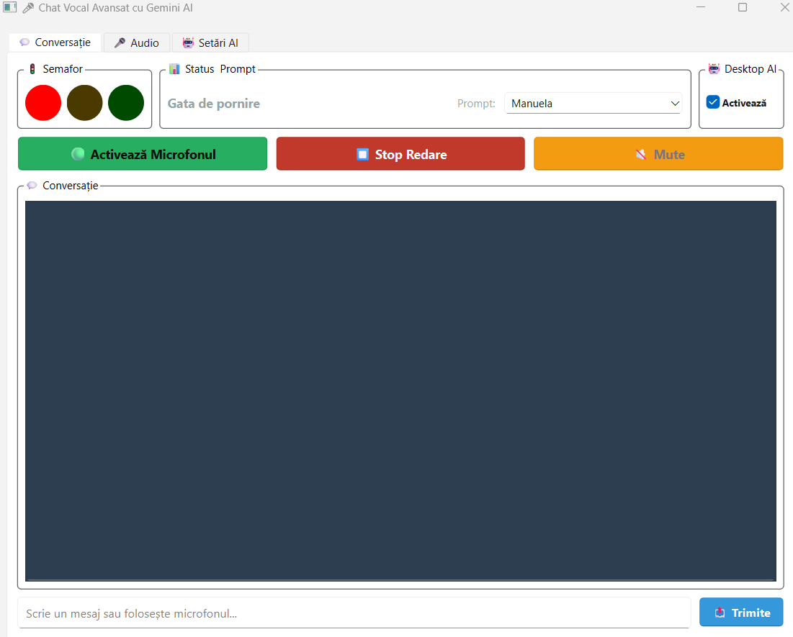

# 🎤 Chat Vocal Avansat cu Gemini AI

> Asistent vocal inteligent cu suport multimodal (text + screenshot), sistem avansat de prompturi multiple și detectare vocală de ultimă generație

[](https://www.python.org/downloads/)
[](LICENSE)
[](https://github.com)

Un asistent AI vocal complet funcțional construit cu Google Gemini API, care combină recunoaștere vocală, text-to-speech și capacități multimodale într-o interfață prietenoasă Qt. **Sistem inovator de prompturi multiple** pentru personalizare instantanee a personalității AI-ului.

---




## ✨ Caracteristici Principale

### 🎯 Funcționalități Core
- ✅ **Recunoaștere vocală continuă** cu Silero VAD (Voice Activity Detection)
- ✅ **Text-to-Speech natural** în limba română (voce bărbat/femeie)
- ✅ **Chat text + vocal** - folosește microfon sau tastatura
- ✅ **Streaming responses** - răspunsuri în timp real
- ✅ **Memorie conversațională** configurabilă (1-50 replici)
- ✅ **Auto-calibrare zgomot ambient** pentru precizie maximă
- ✅ **Selectare model AI** - Flash (rapid) sau Pro (avansat)

### 📝 **Sistem Prompturi Multiple** ⭐ NOU!
- 📁 **Management complet** - creează, editează, șterge prompturi
- 🔄 **Schimbare instantanee** - ComboBox în interfața principală
- 💾 **Fișiere separate** - folder `prompts/` cu fișiere `.txt` editabile
- 🎭 **Personalități multiple** - asistent tehnic, profesor, prieten casual
- ⚡ **Resetare automată** context la schimbare prompt
- 🔖 **Memorie persistentă** - își amintește promptul selectat

### 🤖 Desktop Assistant (Multimodal)
- 📸 **Screenshot automat** al ecranului la fiecare întrebare
- 👁️ **Analiză vizuală** - AI-ul "vede" ce ai pe ecran
- 💬 **Context inteligent** - combină istoric text-only cu screenshot curent
- 🔄 **Activare/dezactivare rapidă** din interfață

### 🎛️ Control Audio Avansat
- 🎚️ **Calibrare automată** sau manuală a pragului de energie
- ⏱️ **Durata maximă configurabilă** pentru vorbire continuă
- 🔇 **Anulare ecou** - previne feedback AI→microfon
- 🚦 **Semafor vizual** cu stări (roșu/galben/verde)
- ⏹️ **Stop forțat** redare audio
- **⏱️ Cronometrele vizuale** ⭐ NOU!
  - Afișare timp rămas pe semafor verde (max 15s)
  - Afișare progres pauză pe semafor galben
  - Centrate în mijlocul cercurilor, vizibile și clare

### 📦 Distribuție și Împachetare ⭐ NOU!
- 🎁 **Build ca EXE** - fișier `.spec` optimizat pentru PyInstaller
- 🤖 **Script automat** - `build.bat` pentru Windows
- 📋 **Documentație completă** - ghiduri pas-cu-pas pentru build
- 💼 **Portabil** - un singur executabil, nu necesită Python

---

## 📸 Screenshots

> *Screenshots vor fi adăugate curând*

| Interfață principală | Setări audio | Prompturi Multiple |
|:---:|:---:|:---:|
|  |  |  |

---

## 🛠️ Cerințe de Sistem

### Sistem de Operare
- ✅ Windows 10/11 (testat)
- ✅ Linux (Ubuntu 20.04+)
- ⚠️ macOS (netest - ar trebui să funcționeze)

### Python
- **Python 3.8 sau mai nou**
- **pip** (package manager)

### Hardware
- 🎤 Microfon funcțional
- 🔊 Difuzoare/căști pentru TTS
- 💻 Minim 4GB RAM (recomandat 8GB pentru PyTorch)
- 📡 Conexiune la internet pentru API și modele

---

## 📦 Instalare

### 1. Clone Repository
```bash
git clone https://github.com/username/voice-chat-gemini.git
cd voice-chat-gemini
```

### 2. Creează Virtual Environment (recomandat)
```bash
# Windows
python -m venv venv
venv\Scripts\activate

# Linux/macOS
python3 -m venv venv
source venv/bin/activate
```

### 3. Instalează Dependențele
```bash
pip install -r requirements.txt
```

#### Lista Dependențelor Principale
```
PySide6>=6.5.0
google-generativeai>=0.3.0
python-dotenv>=1.0.0
edge-tts>=6.1.0
pygame>=2.5.0
SpeechRecognition>=3.10.0
torch>=2.0.0
sounddevice>=0.4.6
numpy>=1.24.0
Pillow>=10.0.0
markdown>=3.4.0
```

### 4. Obține API Key Google Gemini

1. Accesează [Google AI Studio](https://makersuite.google.com/app/apikey)
2. Generează o cheie API gratuită
3. Creează un fișier `.env` în folderul proiectului:

```bash
# Fișier .env
GOOGLE_API_KEY="your-api-key-here"
```

**IMPORTANT:** NU partaja niciodată cheia ta API! Adaugă `.env` în `.gitignore`.

---

## 🚀 Pornire Rapidă

### Rulează Aplicația
```bash
python voice_chat.py
```

### Primul Start
La prima pornire, aplicația va:
1. ✅ Cere cheia API (dacă nu există `.env`)
2. ✅ Încărca modelul Silero VAD (~100MB, se descarcă o singură dată)
3. ✅ Crea fișierele de configurare (`voice_chat_config.json`)
4. ✅ Crea folderul `prompts/` cu promptul default
5. ✅ Crea folderul `screenshots/` pentru Desktop Assistant

---

## 📖 Ghid de Utilizare

### 🎤 Chat Vocal

#### Activare Microfon
1. Click pe **"🟢 Activează Microfonul"**
2. (Opțional) Se face auto-calibrare 2 secunde
3. Semaforul devine verde 🟢
4. Vorbește natural!

#### Control în Timp Real
- **Verde 🟢** - Ești detectat că vorbești
  - **Cronometru verde** - arată timpul rămas (max 15s)
- **Galben 🟡** - Pauză (se pregătește să proceseze)
  - **Cronometru galben** - arată progresul pauzei
- **Roșu 🔴** - Nu asculți (AI vorbește sau sistem ocupat)

#### Buton Mute
- Click **"🔇 Mute"** pentru a pausa temporar ascultarea
- Util când AI-ul vorbește și nu vrei să-l întrerupi

### 💬 Chat Text

1. Scrie mesajul în câmpul de jos
2. Apasă **Enter** sau click **"📤 Trimite"**
3. Primești răspuns instant (cu sau fără TTS)

### 📝 Sistem Prompturi Multiple ⭐ FEATURE PRINCIPAL

#### Utilizare Rapidă
1. **În interfața principală** (zona Status & Prompt)
   - Click pe **ComboBox-ul "Prompt:"** (în dreapta)
   - Selectează promptul dorit din listă
   - AI-ul își schimbă instant personalitatea
   - **Conversația și contextul se resetează automat**

#### Management Prompturi (Tab Setări AI)

**📝 Creează Prompt Nou:**
1. Click **"➕ Adaugă Nou"**
2. Introdu **nume** descriptiv (ex: "Asistent Programare")
3. Scrie **conținutul** promptului
4. **OK** → Gata! Apare în listă

**✏️ Editează Prompt:**
1. Selectează promptul din ComboBox
2. Click **"✏️ Editează"**
3. Modifică textul
4. **OK** → Salvare automată + reinițializare AI

**🗑️ Șterge Prompt:**
1. Selectează promptul din ComboBox
2. Click **"🗑️ Șterge"**
3. Confirmare → Promptul e șters
4. ⚠️ Dacă ștergi promptul activ, se comută automat pe altul

#### Exemple de Prompturi

**Asistent Tehnic:**
```
Ești un expert tehnic specializat în programare și IT. 
Răspunsurile tale sunt precise, detaliate și bazate pe best practices.
Explici concepte complexe clar și oferă exemple de cod când e relevant.
```

**Profesor de Matematică:**
```
Ești un profesor de matematică pasionat și răbdător.
Explici concepte matematice pas cu pas, folosind exemple simple.
Încurajezi elevul și verifici înțelegerea înainte de a merge mai departe.
```

**Prieten Casual:**
```
Ești un prieten de încredere care vorbește natural și relaxat. 
Folosești umor când e cazul și explici lucrurile simplu.
Ești empatic și deschis la conversații despre orice subiect.
```

**Asistent Creativ:**
```
Ești un asistent creativ care ajută la brainstorming și idei inovatoare.
Gândești out-of-the-box și propui soluții neconvenționale.
Încurajezi experimentarea și nu te temi de idei îndrăznețe.
```

#### Editare Manuală (Avansați)
Poți edita fișierele direct în folderul `prompts/`:
1. Deschide `prompts/numele_prompt.txt` cu orice editor
2. Modifică conținutul
3. Salvează fișierul
4. În aplicație: schimbă pe alt prompt și înapoi pentru reload

### 🤖 Desktop Assistant Mode

#### Activare
1. Bifează **"🤖 Activează"** (casetă în partea de sus)
2. Pune o întrebare despre ecran: *"Ce aplicații văd deschise?"*
3. AI-ul va primi automat un screenshot + textul tău
4. Răspunsul va fi contextualizat la ce vede pe ecran

#### Use Cases
- 📊 "Analizează graficul din Excel"
- 🐛 "Ce eroare văd în cod?"
- 📝 "Rezumă documentul deschis"
- 🎨 "Ce culori domină în imaginea asta?"
- 🖥️ "Câte ferestre am deschise?"

**Notă:** Screenshot-urile sunt salvate în `screenshots/` pentru referință și șterse automat la pornire.

---

## ⚙️ Configurare Avansată

### 🎛️ Tab Audio

#### Auto-Calibrare
- ✅ **Activat implicit** - recomandată
- Durată: 2 secunde de liniște la pornirea microfonului
- Ajustează automat pragul în funcție de zgomotul ambient

#### Setări Manuale
- **Prag Energie** (100-12000): Sensibilitatea microfonului
  - Mai jos = mai sensibil (detectează și șoapte)
  - Mai sus = mai puțin sensibil (doar voce tare)
- **Pauză Sfârșit** (0.5s-5.0s): Cât așteptăm după ce termini de vorbit
- **Durată Max Vorbire** (5s-30s): Limită pentru mesaje lungi

#### TTS (Text-to-Speech)
- **Voce Emil** (bărbat) sau **Alina** (femeie)
- Dezactivează TTS pentru răspunsuri only-text

### 🤖 Tab Setări AI

#### Model AI
Alege între:
- **Gemini Flash** - Rapid, eficient, ideal pentru uz zilnic
- **Gemini Pro** - Mai avansat, răspunsuri mai detaliate

Schimbarea modelului resetează conversația.

#### Memorie Conversație
- **1-50 replici** (implicit 10)
- Controlează cât de mult își amintește AI-ul din conversații anterioare
- Mai mult = context mai bogat, dar prompt mai mare

---

## 📁 Structura Proiectului

```
voice-chat-gemini/
├── voice_chat.py                    # Aplicația principală
├── requirements.txt                 # Dependențe Python
├── .env                             # API Key (NU include în Git!)
├── .gitignore                       # Fișiere ignorate de Git
├── README.md                        # Acest fișier
│
├── prompts/                         # ⭐ NOU: Prompturi multiple
│   ├── default.txt                  # Prompt implicit
│   ├── asistent_cod.txt            # Prompt pentru programare
│   ├── profesor.txt                # Prompt educațional
│   └── casual.txt                  # Prompt conversațional
│
├── voice_chat_config.json           # Configurări (auto-generat)
│
├── screenshots/                     # Screenshot-uri Desktop Assistant
│   └── screenshot_2025-*.png
│
├── build/                           # ⭐ NOU: Fișiere build (opțional)
│   ├── voice_chat.spec             # Configurare PyInstaller
│   ├── build.bat                   # Script automat build
│   └── BUILD_INSTRUCTIONS.md       # Ghid de împachetare
│
└── temp_speech_*.mp3                # Fișiere TTS temporare (auto-șterse)
```

---

## 📦 Împachetare ca EXE ⭐ NOU!

Aplicația poate fi împachetată ca executabil Windows standalone, fără să necesite Python instalat.

### Cerințe
```bash
pip install pyinstaller
```

### Metoda Rapidă (Windows)
```bash
# Rulează scriptul automat
build.bat
```

Executabilul va fi în `dist/VoiceChat_Gemini.exe` (~500MB-1GB).

### Metoda Manuală
```bash
# Cu fișierul .spec (recomandat)
pyinstaller voice_chat.spec

# Sau comandă directă
pyinstaller --onefile --name="VoiceChat_Gemini" voice_chat.py
```

### Personalizări

**Fără consolă (doar fereastră):**
În `voice_chat.spec`, schimbă `console=True` → `console=False`

**Adaugă iconiță:**
În `voice_chat.spec`, schimbă `icon=None` → `icon='icon.ico'`

### Distribuție
Pentru distribuție, include:
- `VoiceChat_Gemini.exe`
- Fișierul `.env` (sau instrucțiuni pentru cheia API)
- Folder `prompts/` (opțional, se creează automat)

**Documentație completă:** Vezi `BUILD_INSTRUCTIONS.md`

---

## 🔧 Troubleshooting

### Microfon nu funcționează
**Problemă:** Semaforul rămâne roșu, nu detectează vocea.

**Soluții:**
1. Verifică că microfonul e conectat și funcțional
2. În Windows: Setări → Confidențialitate → Microfon → Permite acces
3. Încearcă **auto-calibrare** (bifează în tab Audio)
4. Mărește **Prag Energie** manual

### Eroare "API Key invalid"
**Problemă:** `google.api_core.exceptions.PermissionDenied`

**Soluții:**
1. Verifică că ai creat corect fișierul `.env`
2. Verifică că API key-ul e valid în [Google AI Studio](https://makersuite.google.com/app/apikey)
3. Șterge `.env` și repornește → aplicația va cere din nou cheia

### Prompturile nu se încarcă
**Problemă:** ComboBox-ul e gol sau eroare la pornire.

**Soluții:**
1. Verifică că există folderul `prompts/`
2. Verifică că există măcar un fișier `.txt` în folder
3. Șterge `voice_chat_config.json` și repornește (resetează config)
4. Verifică log-urile: `[PROMPTS]` pentru detalii

### Eroare la ștergerea promptului
**Problemă:** "Nu poți șterge ultimul prompt"

**Explicație:** Trebuie să existe măcar un prompt în sistem.

**Soluție:** Creează un prompt nou înainte de a șterge ultimul.

### TTS nu funcționează
**Problemă:** AI-ul răspunde dar nu vorbește.

**Soluții:**
1. Verifică că TTS e **activat** în tab Audio
2. Verifică volumul difuzoarelor
3. Verifică conexiunea la internet (TTS folosește edge-tts online)

### Desktop Assistant nu trimite screenshot
**Problemă:** AI-ul nu "vede" ecranul.

**Soluții:**
1. Verifică că bifa **"Activează"** e bifată în caseta "🤖 Desktop AI"
2. Verifică în log-uri: ar trebui să vezi `✅ [ASSISTANT] Screenshot capturat!`
3. Verifică permisiunile de screenshot pe sistemul tău

### EXE nu pornește (după build)
**Problemă:** Eroare la rularea executabilului.

**Soluții:**
1. Rulează cu `console=True` în `.spec` pentru a vedea erorile
2. Verifică că ai inclus toate dependențele în `hiddenimports`
3. Prima rulare necesită internet (descarcă modele VAD)
4. Verifică antivirus-ul (uneori blochează PyInstaller)

---

## 🐛 Debug Mode

Pentru debugging avansat, modifică log config în `voice_chat.py`:

```python
LOG_CONFIG = {
    "app": True,
    "config": True,
    "cleanup": True,
    "audio": True,      # ← Setează True pentru debug audio
    "vad": True,
    "process": True,
    "transcription": True,
    "voice": True,
    "tts": True,
    "tts_debug": True,  # ← Setează True pentru debug TTS detaliat
    "echo": True,
    "mute": True,
    "gemini": True,
    "gemini_debug": True,  # ← Setează True pentru traceback-uri complete
    "semafor": False,      # ← Setează True pentru debug semafor
}
```

---

## 🤝 Contribuții

Contribuțiile sunt binevenite! 🎉

### Cum să contribui

1. **Fork** repository-ul
2. **Creează** un branch nou (`git checkout -b feature/AmazingFeature`)
3. **Commit** modificările (`git commit -m 'Add some AmazingFeature'`)
4. **Push** pe branch (`git push origin feature/AmazingFeature`)
5. **Deschide** un Pull Request

### Guidelines

- ✅ Cod comentat și lizibil
- ✅ Respectă stilul existent
- ✅ Testează modificările înainte de PR
- ✅ Documentează feature-uri noi în README

### Idei pentru Contribuții

- 🌍 Suport pentru mai multe limbi
- 🎨 Teme UI personalizabile (dark/light mode)
- 📊 Grafice pentru istoric conversații
- 🔌 Plugin system pentru extensii
- 📱 Versiune mobile (React Native/Flutter)
- 🎙️ Streaming audio input pentru latency mai mică
- 🔗 Import/export prompturi (share community presets)
- 🎯 Hotkeys globale pentru control rapid

---

## 📄 Licență

Acest proiect este licențiat sub **MIT License** - vezi fișierul [LICENSE](LICENSE) pentru detalii.

```
MIT License

Copyright (c) 2025 [Numele Tău]

Permission is hereby granted, free of charge, to any person obtaining a copy
of this software and associated documentation files (the "Software"), to deal
in the Software without restriction, including without limitation the rights
to use, copy, modify, merge, publish, distribute, sublicense, and/or sell
copies of the Software, and to permit persons to whom the Software is
furnished to do so, subject to the following conditions:

The above copyright notice and this permission notice shall be included in all
copies or substantial portions of the Software.

THE SOFTWARE IS PROVIDED "AS IS", WITHOUT WARRANTY OF ANY KIND, EXPRESS OR
IMPLIED, INCLUDING BUT NOT LIMITED TO THE WARRANTIES OF MERCHANTABILITY,
FITNESS FOR A PARTICULAR PURPOSE AND NONINFRINGEMENT. IN NO EVENT SHALL THE
AUTHORS OR COPYRIGHT HOLDERS BE LIABLE FOR ANY CLAIM, DAMAGES OR OTHER
LIABILITY, WHETHER IN AN ACTION OF CONTRACT, TORT OR OTHERWISE, ARISING FROM,
OUT OF OR IN CONNECTION WITH THE SOFTWARE OR THE USE OR OTHER DEALINGS IN THE
SOFTWARE.
```

---

## 🙏 Mulțumiri

- **Google** pentru Gemini API
- **Anthropic** pentru inspirație în design conversațional
- **Silero Team** pentru modelul VAD excelent
- **Comunitatea Python** pentru bibliotecile extraordinare
- **Microsoft** pentru edge-tts
- **Qt Project** pentru PySide6

---

## 📞 Contact & Suport

- 📧 **Email:** your.email@example.com
- 🐛 **Issues:** [GitHub Issues](https://github.com/username/voice-chat-gemini/issues)
- 💬 **Discussions:** [GitHub Discussions](https://github.com/username/voice-chat-gemini/discussions)
- 🌐 **Website:** [your-website.com](https://your-website.com)

---

## ⭐ Star History

Dacă proiectul ți-a fost util, oferă-i un **⭐ star** pe GitHub! 

[](https://star-history.com/#username/voice-chat-gemini&Date)

---

## 🗺️ Roadmap

### v1.0 (Current) ✅
- [x] Chat vocal cu Gemini
- [x] TTS în limba română
- [x] Desktop Assistant multimodal
- [x] Sistem prompturi multiple ⭐ NOU
- [x] Auto-calibrare audio
- [x] Selectare model AI (Flash/Pro)
- [x] Cronometrele vizuale pe semafoare
- [x] Build ca EXE cu PyInstaller

### v1.1 (Next) 🔜
- [ ] Import/export prompturi (share presets)
- [ ] Suport multiple monitoare
- [ ] Recorder conversații
- [ ] Export conversații (PDF/JSON/Markdown)
- [ ] Hotkeys globale
- [ ] Dark/Light mode UI

### v2.0 (Future) 🚀
- [ ] Plugin system pentru extensii
- [ ] API REST pentru integrări externe
- [ ] Web interface (remote control)
- [ ] Mobile app companion
- [ ] Cloud sync pentru configurări și prompturi
- [ ] Voice cloning pentru TTS personalizat

---

<div align="center">

**Făcut cu ❤️ și ☕ în România**

*Sistem inovator de prompturi multiple - schimbă personalitatea AI-ului într-un click!*

[⬆ Back to top](#-chat-vocal-avansat-cu-gemini-ai)

</div>
